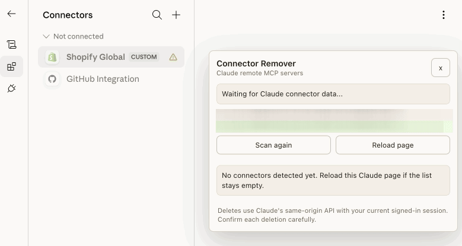

# Claude Connector Remover

Claude Connector Remover is an unpacked Chrome extension for deleting remote MCP connectors from Claude's connectors page.

## Why this exists

Claude can keep remote MCP connectors attached to your account even when the web UI does not expose a delete button for them. The backend delete endpoint still works, but using it manually is awkward: you have to open DevTools, find your organization UUID, inspect the MCP bootstrap event stream, copy the correct connector server UUID, and then run a `fetch()` call by hand.

This extension turns that manual cleanup flow into a small panel on `https://claude.ai/customize/connectors`. It finds the UUIDs for you, shows the detected connectors, and sends the same authenticated delete request after you confirm the connector you want to remove.

## How it works



The extension only runs on Claude's connectors page. A content script injects a page-context agent so the extension can observe Claude's own same-origin network activity while using your already signed-in browser session.

The agent watches for Claude bootstrap requests, including:

- `edge-api/bootstrap/{ORG_UUID}/app_start`, which reveals the organization UUID
- `mcp/v2/bootstrap`, an event stream that includes remote connector records with connector names and server UUIDs

When it detects connector records, the extension renders them in the floating **Connector Remover** panel. Pressing **Delete** asks for confirmation and then calls Claude's delete endpoint:

```txt
DELETE /api/organizations/{ORG_UUID}/mcp/remote_servers/{SERVER_UUID}
```

The request is made from Claude's page context with `credentials: include`, so it uses your normal `claude.ai` authentication cookies. The extension does not need you to paste UUIDs, run console snippets, or create custom DevTools requests.

## Install

1. Open `chrome://extensions`.
2. Enable **Developer mode**.
3. Click **Load unpacked**.
4. Select this folder: `remove-claude-connectors`.
5. Open or reload `https://claude.ai/customize/connectors`.

## Use

1. Visit `https://claude.ai/customize/connectors` while signed in.
2. Use the **Connector Remover** panel in the upper-right corner.
3. If the list is empty, click **Reload page** so the extension can observe Claude's bootstrap calls from page start.
4. Confirm deletion for the specific connector.
5. Refresh Claude's connectors page after deletion. Claude Desktop may also need `Ctrl+R` or `Ctrl+Shift+R` because it caches connector data locally.

## Notes

- The extension only runs on `https://claude.ai/customize/connectors*`.
- It does not store connector data outside the page.
- Delete requests are performed in Claude's page context so normal Claude authentication cookies are used.
- Claude may change these private endpoints or response shapes at any time.
